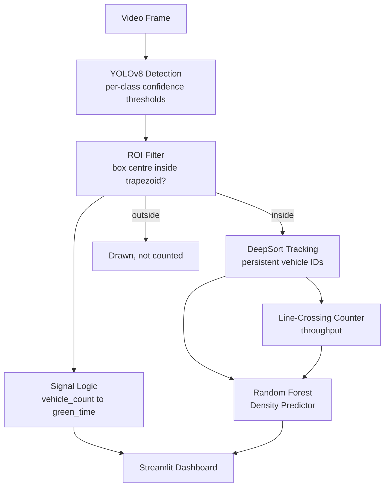

# AI Traffic Management System

Adaptive traffic-signal timing from a single CCTV camera feed: YOLOv8 detection, DeepSort tracking, and a Random Forest model that predicts congestion half a second ahead.


<!-- Record a short demo and drop it at assets/demo.gif — see assets/README.md for how -->


## What this does

Points a YOLOv8 model at a traffic camera feed, counts vehicles inside a defined region of interest (weighting them by type — a truck counts for more than a bicycle), and uses that count to set an adaptive green-light duration instead of a fixed timer. A DeepSort tracker gives each vehicle a persistent ID so a counting line can measure throughput, and a Random Forest model trained on a rolling window of recent density predicts where congestion is headed a few frames ahead — giving the signal logic a head start rather than only reacting to what's already happened.

## Demo

Run `streamlit run src/traffic_system/dashboard.py` for the full interactive dashboard, or `python -m traffic_system.cli` for a lightweight OpenCV window with the same detection pipeline underneath.

## Architecture



Full walkthrough of each stage, with the reasoning behind it, is in [`docs/architecture.md`](docs/architecture.md).

## Tech stack

| Layer | Tool |
|---|---|
| Object detection | YOLOv8 (Ultralytics) |
| Multi-object tracking | DeepSort (`deep-sort-realtime`) |
| Density forecasting | scikit-learn `RandomForestRegressor` |
| Dashboard | Streamlit |
| Video I/O | OpenCV |
| Testing | pytest |
| Linting | ruff |
| CI | GitHub Actions |

## Key engineering decisions

**Per-class confidence thresholds, not one global cutoff.** Cars, buses, and trucks get a 0.45 confidence floor; motorcycles and bicycles get 0.30. A single global threshold forces a bad trade-off: high enough to suppress noise on large, easy-to-detect vehicles, and that same value misses a lot of real motorcycles, which are smaller, often partially occluded, and score lower even when correctly detected. Splitting the threshold per class recovers motorcycle recall without letting more noise in on the classes that don't need it.

**ROI membership by box-centre, not full-box overlap.** A vehicle entering or leaving the frame edge produces a bounding box that's mostly outside the ROI while the vehicle itself is clearly on the road. Requiring full-box containment would drop or double-count those vehicles across frames. Testing the box centre against the ROI polygon is cheaper than a full polygon-intersection test and matches the intuitive "is this vehicle basically in the lane" question well enough for signal-timing purposes, where exact edge cases matter far less than for something like OCR or measurement.

**`max_age=5`, `n_init=2` for DeepSort.** The defaults (`max_age=20`, roughly `n_init=1`, `max_cosine_distance=0.4`) were tuned down after visible failure modes on the test clips: `max_age=20` let ghost tracks persist and drift across the frame for most of a second after the underlying detection disappeared, and a low `n_init` meant a single noisy detection could get promoted to a confirmed, displayed track. Tightening both trades a bit of tracking continuity (a track is dropped slightly faster during brief occlusion) for far fewer spurious IDs — the right trade for a counting/timing system where a phantom vehicle skews the signal decision, versus a system where losing an ID briefly is just a cosmetic inconvenience.

**Random Forest over a naive rolling average.** A naive average of recent density is always reactive — it reports what already happened, not where things are headed, so the signal logic only ever catches up to congestion after it forms. The RF model is trained on engineered features (mean, std, min, max, linear slope, and short-term rate-of-change over a 30-frame window) to predict density 15 frames ahead, which lets it pick up on a rising trend (increasing slope, positive rate-of-change) before the raw count itself has caught up — the same reason weather forecasting uses trend features rather than "tomorrow will look like today." A Random Forest was chosen over a linear model because vehicle density doesn't respond linearly to its own trend (a slope that's rising fast tends to keep rising for a few more frames, then plateaus as the road fills), and over a small neural net because the feature vector is low-dimensional (36 features) and the training set is modest — a tree ensemble tends to generalize better than a network in that regime without needing much tuning.

## Results / metrics

This repo doesn't ship formal benchmark numbers yet — here's the fastest path to getting real ones instead of guessing:

1. **Detection FPS at imgsz=1280.** Time `detect_vehicles()` over ~200 frames of one of the bundled clips and report frames/sec. On CPU this will likely be single digits; on a GPU, expect it much higher — report both if you have access to one, since "CPU-only, X fps" and "with a GPU, Y fps" are both useful data points for a reviewer.
   ```python
   import time, cv2
   from traffic_system.detection import get_model, detect_vehicles
   model = get_model()
   cap = cv2.VideoCapture("videos/14552311-hd_1920_1080_50fps.mp4")
   times = []
   for _ in range(200):
       ok, frame = cap.read()
       if not ok: break
       t0 = time.perf_counter()
       detect_vehicles(frame, model, frame.shape[1], frame.shape[0])
       times.append(time.perf_counter() - t0)
   print(f"Mean FPS: {1 / (sum(times) / len(times)):.1f}")
   ```
2. **Counting accuracy vs. a manual count.** Pick a ~30-second clip, manually count vehicles crossing the counting line by eye (pause/step through frame by frame), and compare against `crossing_count` from the pipeline over the same span. Report as a percentage or absolute difference — don't round up if it's imperfect, an honest 85-90% reads better than an unverifiable "high accuracy" claim.
3. **RF R² once trained.** After the predictor has seen enough frames to retrain (80+ samples), `density_predictor.confidence` holds the R² of the most recent fit — log it during a run and report the value once it stabilizes.

## Setup

```bash
git clone https://github.com/YOUR_USERNAME/YOUR_REPO.git
cd YOUR_REPO
python -m venv venv
source venv/bin/activate        # Windows: venv\Scripts\activate
pip install -r requirements.txt
pip install -e .                # installs traffic_system as an editable package
```

Add your video files to `videos/` (gitignored — supply your own `.mp4` files; two demo clips were used during development but aren't tracked in the repo). YOLO weights (`yolov8s.pt`) will auto-download via Ultralytics on first run if not already present.

**Dashboard (recommended):**
```bash
streamlit run src/traffic_system/dashboard.py
```

**OpenCV window mode:**
```bash
python -m traffic_system.cli videos/your_clip.mp4
# or, with no argument, it auto-scans videos/ for a file
python -m traffic_system.cli
```

## Limitations & future work

- **Single fixed camera angle.** The ROI is a hand-tuned trapezoid assuming one particular overhead/angled CCTV view; a different camera placement needs the `config.ROI_*` fractions re-tuned, or ideally a perspective-calibration step instead of hardcoded fractions.
- **No multi-camera fusion.** Each camera/intersection runs independently; there's no shared state across intersections, so this can't yet do corridor-level (green-wave) optimization.
- **No real signal hardware integration.** `green_time` is a recommendation surfaced on the dashboard, not something wired to an actual traffic controller — that integration (and its safety requirements) is a substantial separate project.
- **Detection quality depends on lighting/weather**, which isn't addressed here — YOLOv8 confidence on the same clip at night or in heavy rain will differ from the daytime clips this was tuned against.
- **RF predictor needs warm-up time** (80+ frames) before it's trained; before that it falls back to an EMA, which is clearly reported in the dashboard's "Warming up…" state but is worth knowing about if you're evaluating it cold.

## Project structure

```
src/traffic_system/
    config.py        # every tunable constant — ROI geometry, thresholds, weights, timing bands
    detection.py      # YOLO model loading + per-frame filtered detection
    tracking.py       # DeepSort wrapper + line-crossing counter
    signal_logic.py    # signal timing + Random Forest density predictor
    pipeline.py        # orchestrates detection -> ROI -> tracking -> signal -> prediction
    cli.py             # OpenCV window mode entry point
    dashboard.py        # Streamlit dashboard
tests/                 # pytest suite for the pure-logic pieces
docs/architecture.md    # full per-stage architecture writeup
.github/workflows/ci.yml
```
